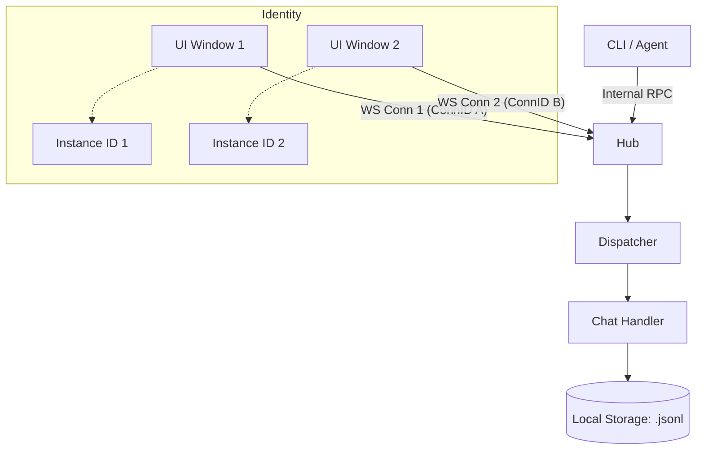
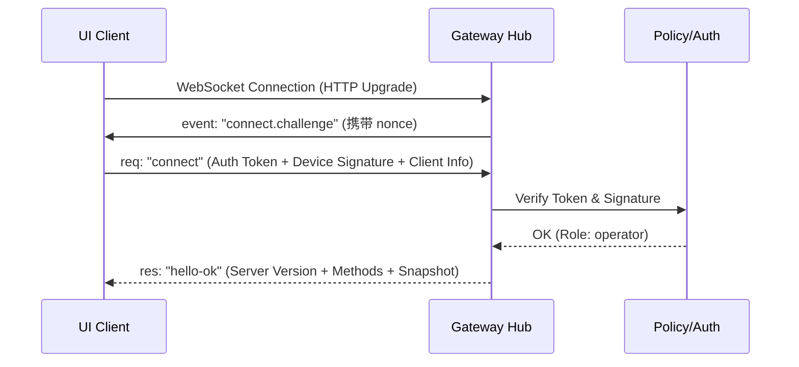
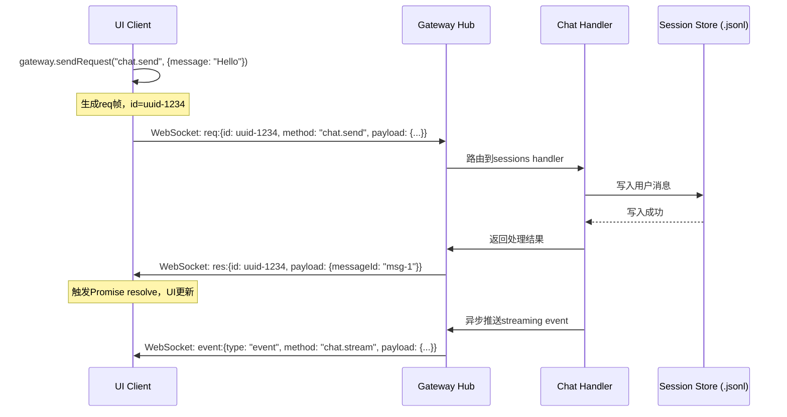
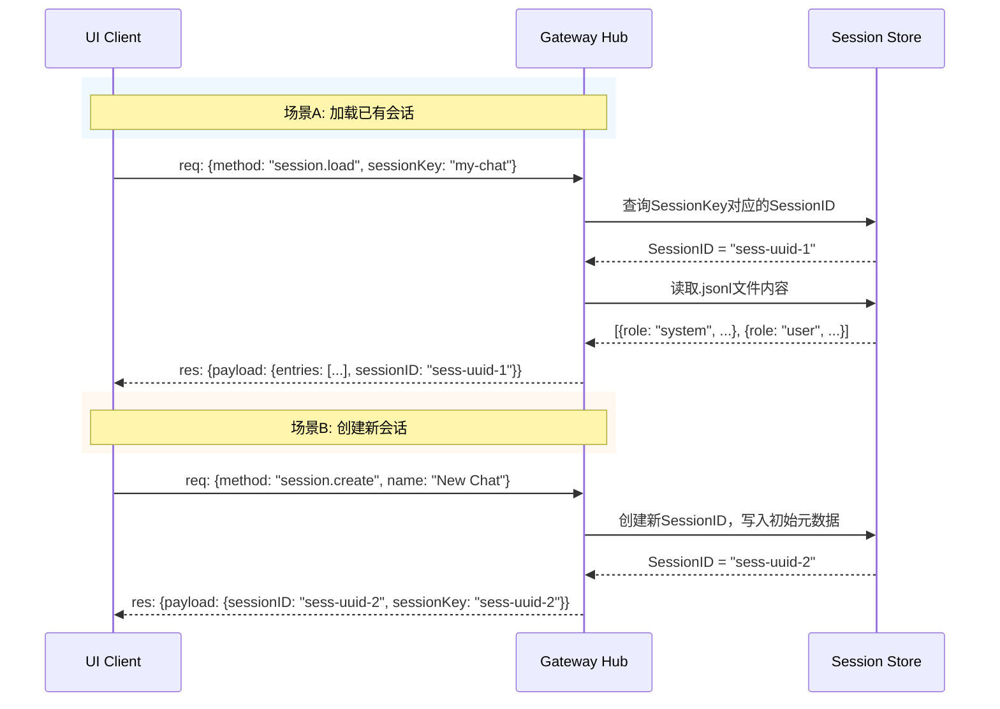
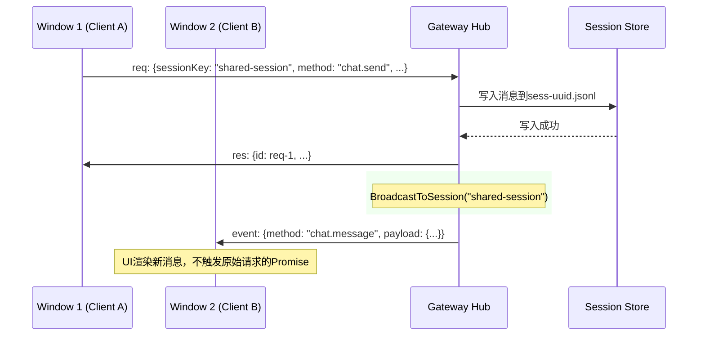
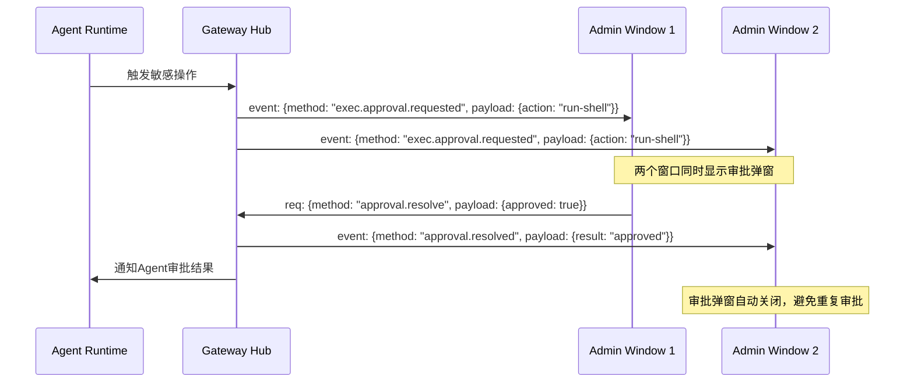

# OpenOcta 架构分析报告

## 1. 项目定位与核心形态
OpenOcta 是一款**企业级 AI Agent 运行时与控制面**。
- **形态**：单一 Go 二进制文件（Single Binary），内嵌前端静态资源。
- **目标**：解决企业内部 AI Agent 的部署、集成、控制与安全审批问题。

## 2. 技术栈
- **后端**：Go 1.24+
- **前端**：TypeScript + Vite + Tailwind CSS
- **桌面框架**：Wails（提供跨平台原生窗口支持）
- **通信协议**：HTTP / WebSocket / MCP (Model Context Protocol)

## 3. 架构设计

### 3.1 启动与进程管理
- **单实例保证**：启动时会检测并清理旧进程，确保数据一致性。
- **Gateway 优先**：后端服务（网关）在桌面窗口创建前启动，UI 通过访问本地网关进行交互。
- **资源内嵌**：利用 `go:embed` 将前端 `dist` 目录打包，部署时无需安装 Node.js。

### 3.2 模块化设计 (pkg/)
- **pkg/agent/runtime**：核心运行时，处理 LLM 调用流、工具链执行逻辑。
- **pkg/gateway/handlers**：精细化的 API 路由管理，涵盖聊天、配置、审批、员工管理等。
- **pkg/mcp**：MCP 协议客户端实现，用于标准化接入第三方 AI 工具。
- **pkg/agent/tools**：系统内置工具（OS 信息、命令执行等），使 Agent 具备实际生产力。

## 4. 关键设计思路

### 4.1 企业级安全控制 (Human-in-the-loop)
项目在 `agent/runtime` 中引入了 **审批中间件 (Approval Middleware)**。对于敏感操作（如执行 shell 命令、访问私有 API），系统会挂起任务并等待用户在 UI 或指定通道进行授权。

### 4.2 数字员工 (Employees) 模型
通过 `pkg/employees` 模块，OpenOcta 将 Agent 抽象为具备特定权限和角色的“数字员工”，而非通用的聊天机器人。

### 4.3 任务自动化 (Cron & Hooks)
集成了定时任务和 Webhook 机制，允许 Agent 在无人值守的情况下，根据预设规则自动执行业务流程。

## 5. 通信机制与会话管理

## 5. 通信机制与会话管理

### 5.1 通信架构概览
OpenOcta 采用基于 **WebSocket** 的“控制-运行时”分离架构。网关作为中心 Hub，协调所有 UI 实例、CLI 工具和 Agent 核心。

#### 核心对象模型
- **Connection (物理连接)**：每个浏览器标签或 Wails 窗口。由 `ConnID` (UUID) 标识。
- **Client Instance (逻辑实例)**：UI 的一次初始化生命周期。由 `InstanceID` 标识。
- **Session (业务会话)**：持久化的对话记录。由 `SessionID` (磁盘 UUID) 和 `SessionKey` (逻辑索引) 标识。



### 5.2 自定义子协议实现
系统在 WebSocket 之上定义了结构化的帧格式，模拟了完整的远程过程调用 (RPC) 机制。

#### 帧类型
1.  **`req` (Request)**: 客户端发起。必须携带 `id` (用于响应回溯) 和 `method` (业务指令)。
2.  **`res` (Response)**: 服务端对请求的同步确认。必须携带对应的 `id`。
3.  **`event` (Event)**: 服务端主动推送的异步通知。不携带 `id`，通常用于流式对话输出或状态更新。

#### 握手时序图 (Handshake Lifecycle)


### 5.3 多窗口会话隔离与同步逻辑

#### 设计思路
OpenOcta 的设计目标是：**“让用户在任何窗口都能继续之前的对话，但在执行敏感操作时精确识别来源。”**

1.  **识别来源**：
    - 后端通过请求中的 `Client.ConnID` 识别物理窗口。
    - 通过 `Client.InstanceID` 识别逻辑前端实例。

2.  **会话隔离 (Isolation)**：
    - 如果前端未提供 `SessionKey`，系统会创建新的 `SessionID`，窗口间彼此隔离。
    - `pkg/session` 负责管理磁盘上的 Session 索引。

3.  **实时共享 (Synchronization)**：
    - **SessionKey 绑定**：当多个窗口通过相同的 `SessionKey` 进行连接时，它们实际上是在操作同一个底层 `.jsonl` 文件。
    - **差异广播 (Diff Broadcast)**：当 Handler 处理完一个修改请求（如发送新消息）后，会调用 `Hub.Broadcast`。Hub 会遍历所有物理连接，将事件推送到所有持有该 `SessionKey` 的活跃连接。

### 5.4 安全审批流 (Human-in-the-loop)
这是多窗口协作中最复杂的场景：
- Agent 发起一个 `exec.approval.requested` 事件。
- **全局通知**：所有通过 WebSocket 连接到该网关的“管理员”角色窗口都会收到弹窗。
- **唯一消费**：一旦某个窗口点击了“通过”或“拒绝”，后端会将 `resolved` 事件同步到所有窗口，并关闭审批界面。

## 6. 核心类与实体定义

### 6.1 后端核心结构体

#### Client (pkg/gateway/ws/hub.go)
WebSocket 连接在服务端的直接表示，每个连接对应一个 Client 实例。

```go
type Client struct {
    ConnID     string           // 物理连接标识，UUID
    InstanceID string           // 前端实例标识，窗口生命周期内不变
    SessionKey *string          // 所属会话Key，可为空（新会话）
    Hub        *Hub             // 所属Hub引用
    Conn       *websocket.Conn  // 底层WebSocket连接
    Send       chan []byte     // 发送队列channel
    Mu         sync.RWMutex    // 保护InstanceID等字段
}
```

**关键方法**：
- `WritePump()`: 协程安全的消息读取循环
- `SendFrame(frame)`: 写入JSON帧到发送队列

#### Hub (pkg/gateway/ws/hub.go)
中央Hub管理所有活跃的WebSocket连接，维护连接映射和会话广播。

```go
type Hub struct {
    Clients    map[string]*Client      // ConnID -> Client
    Sessions   map[string]map[string]*Client  // SessionKey -> ConnID -> Client
    Register   chan *Client            // 新连接注册channel
    Unregister chan *Client             // 断开连接channel
    Broadcast  chan *BroadcastMessage    // 会话广播channel
    Mu         sync.RWMutex             // 保护clients和sessions
}
```

**关键方法**：
- `Run()`: 中央事件循环，处理Register/Unregister/Broadcast
- `RegisterClient()`: 将Client加入Clients map和（可选）Sessions map
- `BroadcastToSession()`: 向持有特定SessionKey的所有连接推送消息

#### ConnectParams (pkg/gateway/handlers/sessions.go)
客户端握手时传递的认证参数。

```go
type ConnectParams struct {
    InstanceID string                 // 前端生成，标识窗口实例
    SessionKey *string                // 客户端传入的会话Key
    AuthToken  string                 // 认证令牌
    Signature  string                 // 设备签名（用于验证设备身份）
    Version    string                 // 客户端版本
}
```

#### SessionEntry (pkg/gateway/handlers/sessions.go)
磁盘上会话记录的基本单元。

```go
type SessionEntry struct {
    SessionID    string    // 会话唯一标识，UUID
    Name         string    // 会话名称
    LastActive   int64     // Unix时间戳
    Model        string    // 使用的模型
    SystemPrompt string    // 系统提示词
}
```

### 6.2 前端核心类

#### GatewayBrowserClient (ui/src/ui/gateway.ts)
前端WebSocket客户端封装，负责与后端Hub建立连接和消息收发。

```typescript
class GatewayBrowserClient {
    private conn: WebSocket | null = null;
    private instanceID: string;           // 窗口实例ID
    private pendingRequests: Map<string, PendingRequest> = new Map();
    private eventHandlers: Map<string, EventHandler[]> = new Map();

    connect(url: string, params: ConnectParams): Promise<HelloResponse>;
    sendRequest<T>(method: string, payload: any): Promise<T>;
    onEvent(event: string, handler: EventHandler): void;
}
```

**关键方法**：
- `connect()`: 执行握手流程，发送connect.req，接收hello-res
- `sendRequest()`: 发送req帧，返回Promise等待res帧
- `onEvent()`: 注册事件监听器，接收event帧

### 6.3 协议帧定义 (pkg/gateway/protocol/frames.go)

```go
type Frame struct {
    Type      string      `json:"type"`       // "req" | "res" | "event"
    ID        string      `json:"id"`         // 请求ID（req/res使用）
    Method    string      `json:"method"`     // 业务方法名（req使用）
    Payload   interface{} `json:"payload"`    // 业务数据
    Error     string      `json:"error,omitempty"` // 错误信息（res使用）
}
```

## 7. 典型场景时序图

### 7.1 消息发送与响应流程


### 7.2 会话创建/加载流程


### 7.3 多窗口同步流程


### 7.4 审批全局通知流程


## 8. 设计模式总结

### 8.1 Hub Pattern (中继器模式)
Hub是典型的**中介者模式**实现：
- 所有客户端不直接通信，而是连接到Hub
- Hub负责消息路由、广播和状态管理
- 客户端数量可动态增减，Hub透明处理

**实现要点**：
- 使用Go channel进行异步消息传递（Register/Unregister/Broadcast）
- Clients和Sessions使用sync.RWMutex保护并发访问
- 每个Client拥有独立的Send channel，实现发送方的协程安全

### 8.2 RPC over WebSocket
虽然基于WebSocket，但实际实现了完整的RPC语义：
- **请求-响应配对**：通过唯一的req.id实现请求与响应的追踪
- **方法分发**：Hub根据frame.Method路由到对应的Handler
- **错误传播**：res帧包含error字段，调用方可通过Promise reject获取

### 8.3 SessionStore Pattern (会话存储模式)
- **逻辑索引 (SessionKey)**：用户友好的字符串，可自定义
- **物理标识 (SessionID)**：UUID，对应磁盘上的.jsonl文件
- **双射映射**：SessionKey <-> SessionID 的双向映射存储在单独的索引文件中
- **差异同步**：通过Hub.Broadcast实现多窗口的增量更新，而非全量同步

### 8.4 设备身份认证 (Device Identity)
握手阶段采用Challenge-Response机制：
1. 服务端生成nonce并发送challenge
2. 客户端使用私钥对nonce+timestamp签名
3. 服务端验证签名，确认设备合法性
4. 颁发带角色信息的会话令牌

这种设计确保了：
- 只有授权设备才能建立WebSocket连接
- 会话令牌与设备绑定，防止令牌泄露后被滥用

## 9. 总结
OpenOcta 的设计精髓在于其**极简的部署成本**与**严谨的安全模型**。它通过高度统合的 WebSocket 协议和多级会话管理，实现了一个既能保证多窗口实时同步，又能维持逻辑隔离的企业级 AI 协作平台。

